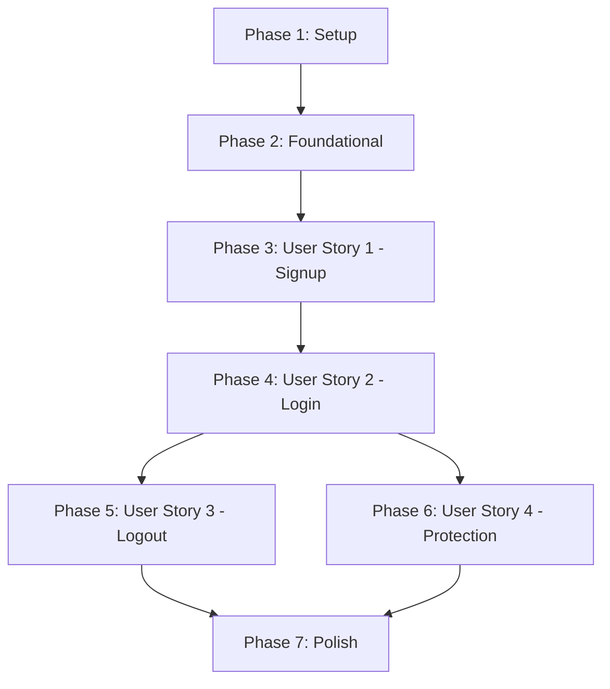

# Tasks: User Authentication API

**Input**: Design documents from `/specs/001-user-auth/`
**Prerequisites**: plan.md (required), spec.md (required), research.md, data-model.md, contracts/

---

## Phase 1: Setup (Shared Infrastructure)

**Purpose**: Project initialization and environment setup

- [x] T001 Configure development scripts (start, dev, test) in [package.json](file:///d:/Meet%20Patel/Personal/intern-task-api/package.json)
- [x] T002 Install runtime dependencies (express, mongoose, bcryptjs, jsonwebtoken, dotenv, multer, cloudinary) and development dependencies (jest, supertest, nodemon) in [package.json](file:///d:/Meet%20Patel/Personal/intern-task-api/package.json)

---

## Phase 2: Foundational (Blocking Prerequisites)

**Purpose**: Core configuration and database connection setup

- [x] T003 Initialize MongoDB connection using Mongoose in [src/config/db.js](file:///d:/Meet%20Patel/Personal/intern-task-api/src/config/db.js)
- [x] T004 Create shared upload middleware with a strict 2MB limit in [src/middleware/upload.middleware.js](file:///d:/Meet%20Patel/Personal/intern-task-api/src/middleware/upload.middleware.js)

---

## Phase 3: User Story 1 - Secure User Signup (Priority: P1) 🎯 MVP

**Goal**: Allow new visitors to register accounts securely with email validation and hashed passwords.

**Independent Test**: Send a POST request to `/api/auth/signup` with valid registration parameters, check that `201 Created` is returned, and verify the password is securely hashed in the database collection.

- [x] T005 [P] [US1] Define Mongoose User schema with validation and pre-save password-hashing hook in [src/models/user.model.js](file:///d:/Meet%20Patel/Personal/intern-task-api/src/models/user.model.js)
- [x] T006 [US1] Implement registration logic and input validation for signup handler in [src/controllers/auth.controller.js](file:///d:/Meet%20Patel/Personal/intern-task-api/src/controllers/auth.controller.js)
- [x] T007 [US1] Map the signup routing to its respective controller handler in [src/routes/auth.routes.js](file:///d:/Meet%20Patel/Personal/intern-task-api/src/routes/auth.routes.js)

---

## Phase 4: User Story 2 - User Login & Token Generation (Priority: P1)

**Goal**: Authenticate existing users and return both an access token and a refresh token.

**Independent Test**: Send a POST request to `/api/auth/login` with correct credentials, and check that `200 OK` is returned alongside an `accessToken` and a `refreshToken` in the JSON payload.

- [x] T008 [P] [US2] Add refreshToken field with a default value of null to the Mongoose User schema in [src/models/user.model.js](file:///d:/Meet%20Patel/Personal/intern-task-api/src/models/user.model.js)
- [x] T009 [US2] Implement credential validation and token generation for login handler in [src/controllers/auth.controller.js](file:///d:/Meet%20Patel/Personal/intern-task-api/src/controllers/auth.controller.js)
- [x] T010 [US2] Map the login routing to its respective controller handler in [src/routes/auth.routes.js](file:///d:/Meet%20Patel/Personal/intern-task-api/src/routes/auth.routes.js)

---

## Phase 5: User Story 3 - Secure User Logout (Priority: P2)

**Goal**: Invalidate session by deleting the active refresh token.

**Independent Test**: Send a POST request to `/api/auth/logout` with the active refresh token, and verify that the token is successfully deleted from MongoDB.

- [x] T011 [US3] Implement token invalidation and database deletion for logout handler in [src/controllers/auth.controller.js](file:///d:/Meet%20Patel/Personal/intern-task-api/src/controllers/auth.controller.js)
- [x] T012 [US3] Map the logout routing to its respective controller handler in [src/routes/auth.routes.js](file:///d:/Meet%20Patel/Personal/intern-task-api/src/routes/auth.routes.js)

---

## Phase 6: User Story 4 - Protected Route Access (Priority: P2)

**Goal**: Guard sensitive resources by intercepting requests and verifying access tokens.

**Independent Test**: Send a request to a protected endpoint without an authorization header, verify it is blocked with `401 Unauthorized`, then send a request with a valid token and verify it succeeds.

- [x] T013 [P] [US4] Implement JWT verification route protection middleware in [src/middleware/auth.middleware.js](file:///d:/Meet%20Patel/Personal/intern-task-api/src/middleware/auth.middleware.js)
- [x] T014 [P] [US4] Create middleware JWT verification unit tests in [tests/unit/auth.middleware.test.js](file:///d:/Meet%20Patel/Personal/intern-task-api/tests/unit/auth.middleware.test.js)

---

## Phase 7: Polish & Cross-Cutting Concerns

**Purpose**: Assemble final server parts and test implementation compliance

- [x] T015 Create base Express app instance mounting authentication routes in [src/app.js](file:///d:/Meet%20Patel/Personal/intern-task-api/src/app.js)
- [x] T016 Create server bootstrap listener mounting database connection in [src/server.js](file:///d:/Meet%20Patel/Personal/intern-task-api/src/server.js)
- [x] T017 [P] Create full API integration tests (covering successful signup, login, logout, and error payloads) in [tests/integration/auth.test.js](file:///d:/Meet%20Patel/Personal/intern-task-api/tests/integration/auth.test.js)
- [x] T018 [P] Create API contract validation tests matching OpenAPI spec in [tests/contract/auth.contract.test.js](file:///d:/Meet%20Patel/Personal/intern-task-api/tests/contract/auth.contract.test.js)
- [x] T019 Execute complete Jest test suite and resolve linting checks across the workspace

---

## Dependencies & Execution Order

### Phase Dependencies

### Parallel Opportunities

- **T005 (User Model)** and **T008 (Token Model)** can be worked on in parallel.
- **T013 (Auth Middleware)** and **T014 (Middleware Tests)** can be worked on in parallel once Phase 2 completes.
- **T017 (Integration Tests)** and **T018 (Contract Tests)** can be worked on in parallel during the Polish phase.
