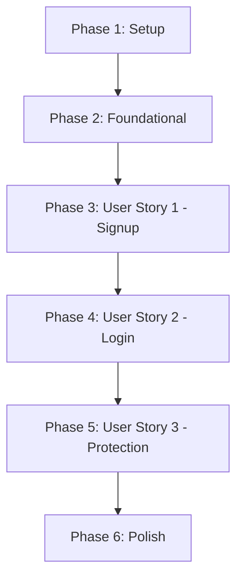

# Tasks: Refactored Authentication & Profile Schema

**Input**: Design documents from `/specs/002-refactor-auth-profile/`
**Prerequisites**: plan.md (required), spec.md (required), research.md, data-model.md, contracts/

---

## Phase 1: Setup (Shared Infrastructure)

**Purpose**: Project setup and environmental bootstrapping

- [ ] T001 Create environmental configuration example in [.env.example](file:///d:/Meet%20Patel/Personal/intern-task-api/.env.example)

---

## Phase 2: Foundational (Blocking Prerequisites)

**Purpose**: Core model split architecture definition

- [ ] T002 Delete the obsolete Mongoose model in [src/models/user.model.js](file:///d:/Meet%20Patel/Personal/intern-task-api/src/models/user.model.js)
- [ ] T003 [P] Define Mongoose Auth credentials schema with pre-save password-hashing hook in [src/models/auth.model.js](file:///d:/Meet%20Patel/Personal/intern-task-api/src/models/auth.model.js)
- [ ] T004 [P] Define Mongoose Profile descriptive schema linked via authId reference in [src/models/profile.model.js](file:///d:/Meet%20Patel/Personal/intern-task-api/src/models/profile.model.js)

---

## Phase 3: User Story 1 - Secure Signup with Split Models (Priority: P1) 🎯 MVP

**Goal**: Allow visitors to register accounts causing simultaneous, linked creation of Auth and default Profile documents.

**Independent Test**: Send a signup payload to `/api/auth/signup` and verify one Auth document (email, hashed password) and one Profile document (fullName, gender, linked authId) are saved.

- [ ] T005 [US1] Refactor signup controller logic to save Auth and linked Profile sequentially, including automatic rollback on profile creation failures, in [src/controllers/auth.controller.js](file:///d:/Meet%20Patel/Personal/intern-task-api/src/controllers/auth.controller.js)

---

## Phase 4: User Story 2 - User Login with Single JWT (Priority: P1)

**Goal**: Authenticate credentials and issue a single stateless access token, eliminating all refresh token logic.

**Independent Test**: Send a POST request to `/api/auth/login` and verify the returned JSON contains ONLY `accessToken` (no refresh tokens).

- [ ] T006 [US2] Refactor login controller logic to verify credentials against the new Auth model and return strictly the access token in [src/controllers/auth.controller.js](file:///d:/Meet%20Patel/Personal/intern-task-api/src/controllers/auth.controller.js)

---

## Phase 5: User Story 3 - Protected Route Access with Middleware (Priority: P2)

**Goal**: Validate request access statelessly using the single JWT token.

**Independent Test**: Request guarded endpoints with valid and invalid headers to verify proper route interception.

- [ ] T007 [P] [US3] Refactor JWT verification route protection middleware to verify the single stateless accessToken in [src/middleware/auth.middleware.js](file:///d:/Meet%20Patel/Personal/intern-task-api/src/middleware/auth.middleware.js)

---

## Phase 6: Polish & Cross-Cutting Concerns

**Purpose**: Align test files to new schemas and run verification suites

- [ ] T008 [P] Refactor route protection middleware unit tests in [tests/unit/auth.middleware.test.js](file:///d:/Meet%20Patel/Personal/intern-task-api/tests/unit/auth.middleware.test.js)
- [ ] T009 [P] Refactor signup and login integration tests to mock Auth/Profile split models and check token payloads in [tests/integration/auth.test.js](file:///d:/Meet%20Patel/Personal/intern-task-api/tests/integration/auth.test.js)
- [ ] T010 [P] Refactor contract tests verifying signup request schemas and login response payloads match OpenAPI specifications in [tests/contract/auth.contract.test.js](file:///d:/Meet%20Patel/Personal/intern-task-api/tests/contract/auth.contract.test.js)
- [ ] T011 Execute complete Jest test suite and confirm all 16 test assertions pass without regression

---

## Dependencies & Execution Order

### Phase Dependencies

### Parallel Opportunities

- **T003 (Auth Model)** and **T004 (Profile Model)** can be implemented in parallel.
- **T008 (Middleware Unit Tests)**, **T009 (Integration Tests)**, and **T010 (Contract Tests)** can be refactored concurrently during the Polish phase.
